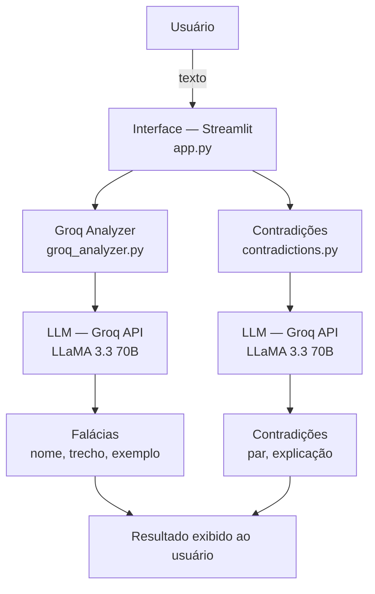

# Argus — Analisador de Coerência Argumentativa

> **Acesse o app:** [projeto-argus-dn5pjrohdkimeuwfvxsbuj.streamlit.app](https://projeto-argus-dn5pjrohdkimeuwfvxsbuj.streamlit.app)

Argus é uma aplicação web que utiliza Inteligência Artificial para detectar **falácias lógicas** e **contradições** em textos, com base na tradição filosófica aristotélica e na lógica informal de Irving Copi.

# Como surgiu

A primeira versão do Argus funcionava com um dicionário de padrões fixos — uma lista de expressões associadas a cada tipo de falácia. O sistema detectava sentenças como "todo mundo sabe" como apelo à popularidade, mas ignorava a sentença "é de conhecimento geral", que carrega o mesmo significado. Qualquer variação de sintaxe ou escolha diferente de palavras passava despercebida.
Ficou claro que um sistema baseado em regras nunca conseguiria acompanhar a riqueza e a ambiguidade da linguagem humana (Linguagem Natural). A solução foi substituir o dicionário por um modelo de linguagem via Groq API — agora o Argus não busca palavras, ele compreende o argumento. Contexto, sinônimos, ironia e nuances passaram a fazer parte da análise.

# Como funciona



Cola isso no README do Argus no GitHub dentro de um bloco de código com a linguagem `mermaid` e o GitHub vai renderizar automaticamente!

1. O usuário digita ou cola qualquer texto na interface
2. O texto é enviado para um LLM via Groq API (LLaMA 3.3 70B)
3. A IA identifica falácias com compreensão semântica real
4. Contradições entre frases são detectadas com Sentence Transformers
5. Os resultados aparecem com descrição e exemplo didático de cada falácia

## Para que serve

- Analisar argumentos em redes sociais, notícias e discursos
- Estudantes que querem melhorar a qualidade das próprias redações
- Pessoas que querem identificar manipulação em propagandas
- Advogados e estudantes de direito que trabalham com argumentação
- Professores que querem ensinar lógica e filosofia de forma prática

## Tecnologias

- Python
- Streamlit
- Groq API + LLaMA 3.3 70B
- Sentence Transformers
- python-dotenv

## Como rodar localmente

1. Clone o repositório:
```bash
git clone https://github.com/ClintSant/Projeto-Argus.git
cd Projeto-Argus
```

2. Crie e ative o ambiente virtual:
```bash
python -m venv venv
venv\Scripts\activate
```

3. Instale as dependências:
```bash
pip install -r requirements.txt
```

4. Crie um arquivo `.env` com sua chave da Groq:
GROQ_API_KEY=sua_chave_aqui

5. Rode a aplicação:
```bash
streamlit run app.py
```

## Estrutura do projeto
argus/
├── app.py
├── analyzer/
│   ├── groq_analyzer.py
│   ├── contradictions.py
│   └── fallacies.py
├── data/
│   └── fallacies.json
└── requirements.txt

## Autor

**Clinton Gonçalves dos Santos**  
Analista de Dados | Cientista de Dados em formação  
[LinkedIn](www.linkedin.com/in/clinton-santos-094b1b214) • [GitHub](https://github.com/ClintSant)

Projeto em construção — melhorias e novas funcionalidades em desenvolvimento.
